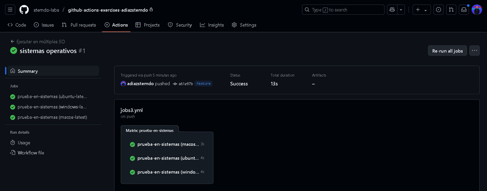

# Jobs y Steps - Ejercicio 3

## Configura un workflow que ejecute el mismo job en diferentes sistemas operativos

Para ejecutar el mismo job en distintos sistemas operativos necesitamos la matriz ***matrix***
Para este ejercicio lo hemos ejecutado en ubuntu, windows y macOS. Si no utilizaramos la matriz matrix tendriamos que crear un job por cada sistema operativo.
Luego al final muestro un mensaje que confirma los Sistemas operativos donde se está ejecutando este workflow

```
name: Ejecutar en múltiples SO

on:
  push:
    branches:
      - feature

jobs:
  prueba-en-sistemas:
    runs-on: ${{ matrix.os }}
    strategy:
      matrix:                                                   # Esta es la parte más importante del workflow
        os: [ubuntu-latest, windows-latest, macos-latest]

    steps:
      - name: Mostrar sistema operativo
        run: echo "Este job está corriendo en ${{ matrix.os }}"
        shell: bash
```

