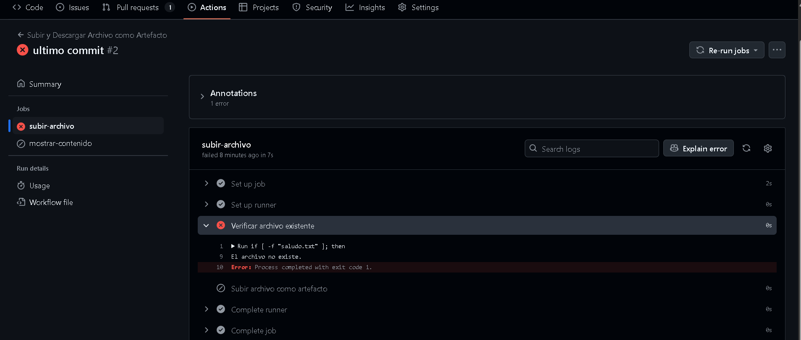

## Crear un workflow que suba un archivo existente en el repositorio como un artefacto, y luego lo descargue y muestre su contenido en una tarea posterior

```
name: Subir y Descargar Archivo como Artefacto

on:
  push:
    branches:
      - feature

jobs:
  subir-archivo:
    runs-on: labs-runner
    steps:
      - name: Verificar archivo existente
        run: |
          if [ -f "saludo.txt" ]; then                              # Para verificar si existe el archivo y muestre un mensaje
            echo "El archivo existe, continuando con la carga..."
          else
            echo "El archivo no existe."
            exit 1
          fi

      - name: Subir archivo como artefacto
        uses: actions/upload-artifact@v4
        with:
          name: archivo-existente
          path: saludo.txt

  mostrar-contenido:
    runs-on: labs-runner
    needs: subir-archivo
    steps:
      - name: Descargar el archivo artefacto
        uses: actions/download-artifact@v4
        with:
          name: archivo-existente

      - name: Mostrar el contenido del archivo
        run: |
          cat saludo.txt                            # Muestra el contenido del archivo si existe
```

No se ejecuta correctamente ya que el archivo no existe
