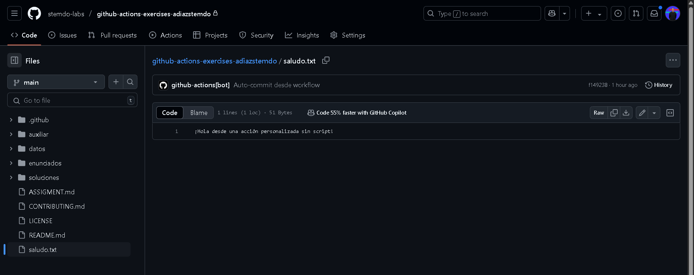
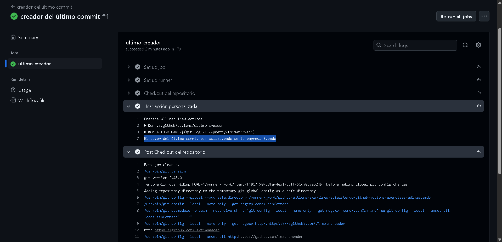

# Actions - Ejercicio 1

## Crear una action personalizada que sea capaz de crear un archivo de texto en el directorio raíz del repositorio con un mensaje

Estos archivos **action** son archivos fáciles de programar y que son totalmente personalizables y suelen encapsular una tarea específica dentro de los workflows
Para este ejercicio he creado un archivo action para que me crea un archivo .txt con un mensaje

Este es el archivo **action.yml** con la siguiente configuración

```
name: Crear archivo de texto
description: Crea un archivo de texto con un mensaje personalizado

inputs:
  filename:
    description: Nombre del archivo a crear
    required: true
  message:
    description: Contenido del archivo
    required: true

runs:
  using: "composite"
  steps:
    - name: Crear archivo
      shell: bash
      run: |
        echo "Creando archivo '${{ inputs.filename }}' con el mensaje:"
        echo "${{ inputs.message }}"
        echo "${{ inputs.message }}" > "${{ inputs.filename }}"

```

Y este es el archivo **actions1-workflow.yml** que sería nuestro workflow que va a llamar al archivo **action.yml** para crear el archivo

```
name: Ejecutando la creación del archivo

on:
  workflow_dispatch:

jobs:
  Ejecucion-del-workflow:
    permissions: write-all
    runs-on: labs-runner
    steps:
      - name: Checkout
        uses: actions/checkout@v3

      - name: Ejecutar acción personalizada
        uses: ./.github/actions/crear-archivo
        with:
          filename: archivo-stemdo.txt
          message: "¡Este es el archivo creado por Alejandro Díaz en Stemdo!"    # He intendado arreglar el workflow para que me                                             escriba este mensaje y no lo he conseguido, le pedí ayuda al chat y me aparece el mensaje por defecto que me da.


      - name: Configurar Git
        run: |
          git config user.name "github-actions [bot]"
          git config user.email "github-actions[bot]@users.noreply.github.com"


```
Se ha ejecutado correctamente!


Este sería el archivo que ha creado.


# Actions - Ejercicio 2

## Crear una custom action usando composite actions que imprime el nombre del autor del último commit en los logs del workflow

Para este ejercicio la dinámica sería la misma que en el anterior
Ahora queremos sacar quien es el autor del último commit que se ha hecho, para ello en el **action.yml** añadiremos la variable ***AUTHOR_NAME=$(git log -1 --pretty=format:'%an')*** 
Así quedaría el código:
```
name: Mostrar autor del último commit
description: Imprime el nombre del autor del último commit en los logs

runs:
  using: "composite"
  steps:
    - name: Obtener autor del último commit
      shell: bash
      run: |
        AUTHOR_NAME=$(git log -1 --pretty=format:'%an') 
        echo "El autor del último commit es: $AUTHOR_NAME de la empresa Stemdo"

```
Y este sería mi workflow:

```
name: creador del último commit

on:
  workflow_dispatch:

jobs:
  ultimo-creador:
    runs-on: labs-runner
    steps:
      - name: Checkout del repositorio
        uses: actions/checkout@v3

      - name: Usar acción personalizada
        uses: ./.github/actions/ultimo-creador

```

Y este es el resultado de correr el workflow, me ha dado el autor del último commit:

