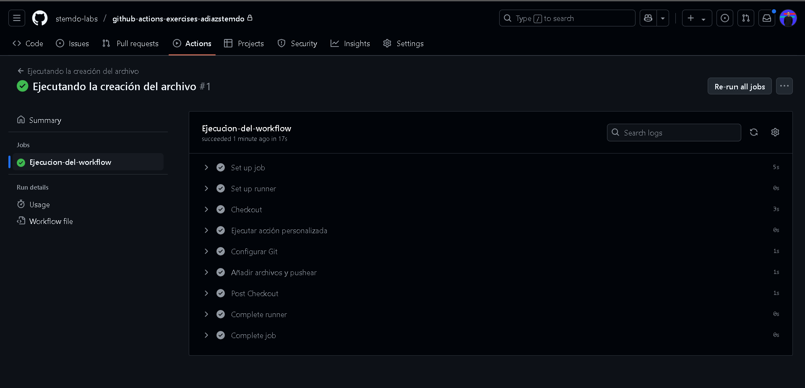

# Actions - Ejercicio 1

## Crear una action personalizada que sea capaz de crear un archivo de texto en el directorio raíz del repositorio con un mensaje

# Actions - Ejercicio 2

## Crear una custom action usando composite actions que imprime el nombre del autor del último commit en los logs del workflow

