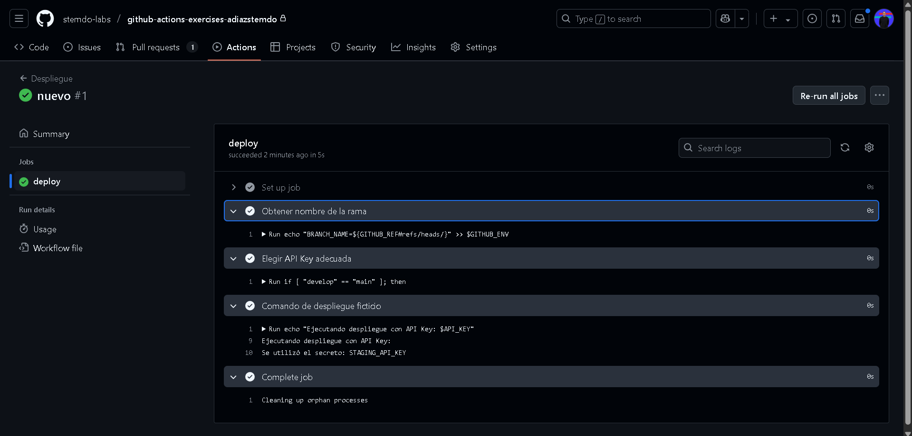

# Contexts - Ejercicio 2

## Configura un workflow que utilice un secreto llamado PROD_API_KEY para realizar un despliegue ficticio si se ejecuta en la rama main, y otro secreto llamado STAGING_API_KEY para cualquier otra rama

**El workflow debería:**

- Utilizar el contexto secrets para inyectar la API Key correspondiente en un comando de despliegue ficticio.
- Imprimir un mensaje indicando cuál API Key se utilizó.

```
name: Despliegue

on:
  push:
    branches:
      - '**'

jobs:
  deploy:
    runs-on: labs-runner
    steps:
      - name: Obtener nombre de la rama
        id: branch
        run: echo "BRANCH_NAME=${GITHUB_REF#refs/heads/}" >> $GITHUB_ENV

      - name: Elegir API Key adecuada
        id: set-api-key
        run: |
          if [ "${{ env.BRANCH_NAME }}" == "main" ]; then
            echo "API_KEY=${{ secrets.PROD_API_KEY }}" >> $GITHUB_ENV
            echo "USO_API=PROD_API_KEY" >> $GITHUB_ENV
          else
            echo "API_KEY=${{ secrets.STAGING_API_KEY }}" >> $GITHUB_ENV
            echo "USO_API=STAGING_API_KEY" >> $GITHUB_ENV
          fi

      - name: Comando de despliegue ficticio
        run: |
          echo "Ejecutando despliegue con API Key: $API_KEY"
          echo "Se utilizó el secreto: $USO_API"
```

