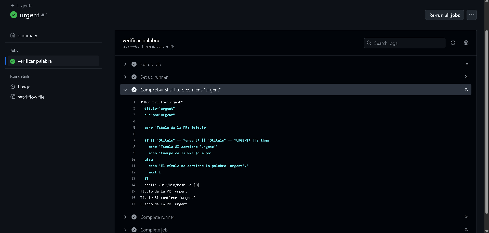
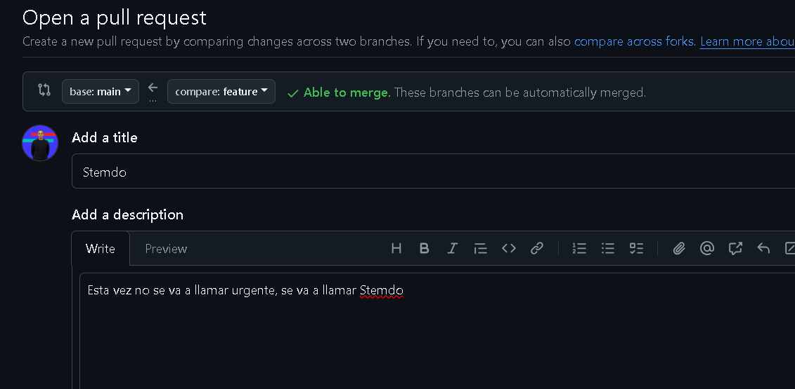
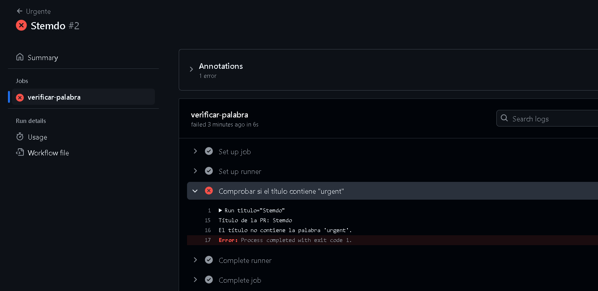

# Contexts - Ejercicio 4

## Configura un workflow que se ejecute cuando se abra una pull_request. El workflow debería verificar si el título del pull request contiene una palabra clave específica (urgent). Si la palabra se encuentra en el título, imprime el título y cuerpo de la PR, si la palabra no se encuentra en el título, haz que la ejecución falle.

Con el evento ***pull_request: types: [opened]*** hago que este workflow se ejecute cuando se hace un pull request.
Además, creando las variables *titulo* y *cuerpo* recojo los titulos y el cuerpo de la pull request para luego con la condición if ejecute un mensaje de verificación

```
name: Urgent

on:
  pull_request:
    types: [opened]

jobs:
  verificar-palabra:
    runs-on: labs-runner

    steps:
      - name: Comprobar si el título contiene "urgent"
        run: |
          titulo="${{ github.event.pull_request.title }}"   # Creo una variable que recoja el título y el nombre del cuerpo de la pull request
          cuerpo="${{ github.event.pull_request.body }}"

          echo "Título de la PR: $titulo"

          if [[ "$titulo" == *urgent* ]]; then
            echo "Título SI contiene 'urgent'"
            echo "Cuerpo de la PR: $cuerpo"
          else
            echo "El título no contiene la palabra 'urgent'."
            exit 1
          fi

```

Al llamar a la pull request *urgent* me lo admite y se ejecuta correctamente:


Pero al cambiarle de nombre y el cuerpo a la pull request no me lo admite con lo cual me da error



