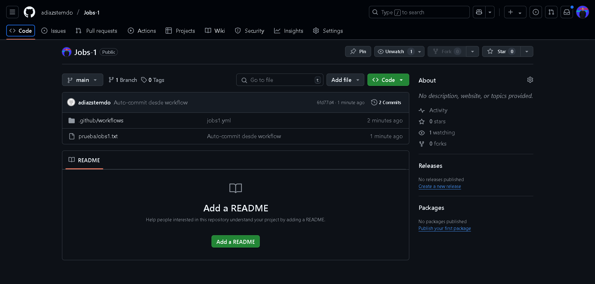
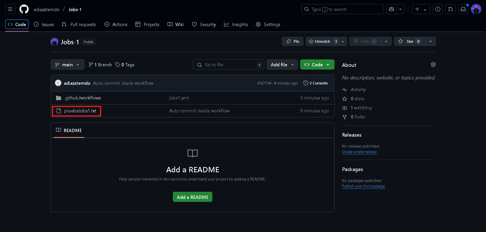

# Jobs y Steps - Ejercicio 1

## Configura un workflow (workflow_dispatch) con un solo job que haga las siguientes tareas:

- Mostrar la fecha y hora actual.
- Crear un archivo de texto.
- Listar los archivos en el directorio actual.
- Hacer un commit y push de cualquier fichero en el repositorio.

Para que este ejercicio me funcionara he tenido que crear un repositorio público.
Creo el yml llamado jobs1.yml con el siguiente código:

```
name: Tareas en Workflow

on:
  workflow_dispatch:

jobs:
  run-tasks:
    runs-on: ubuntu-latest

    steps:
      - name: 
        uses: actions/checkout@v3

      - name: Fecha
        run: date                      # Muestra la fecha

      - name: Crear archivo de texto
        run: touch pruebaJobs1.txt     # Creo el .txt

      - name: Mostrar archivos
        run: ls                       # Listo el contenido

      - name: Configurar Git
        run: |
          git config user.name "adiazstemdo"            # Configuro GIT
          git config user.email "adiazstemdo@io.com"

      - name: Añadir archivos y pushear
        run: |
          git add .
          git commit -m "Auto-commit desde workflow"
          git push                                     # Pusheamos el archivo creado para que se suba a nuestro repositorio
        env:
          GITHUB_TOKEN: ${{ secrets.GITHUB_TOKEN }}

```

Se ejecuta correctamente:


Ha creado y subido el archivo correctamente:


