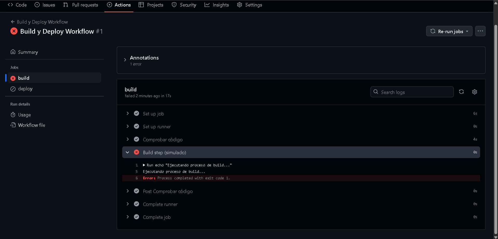
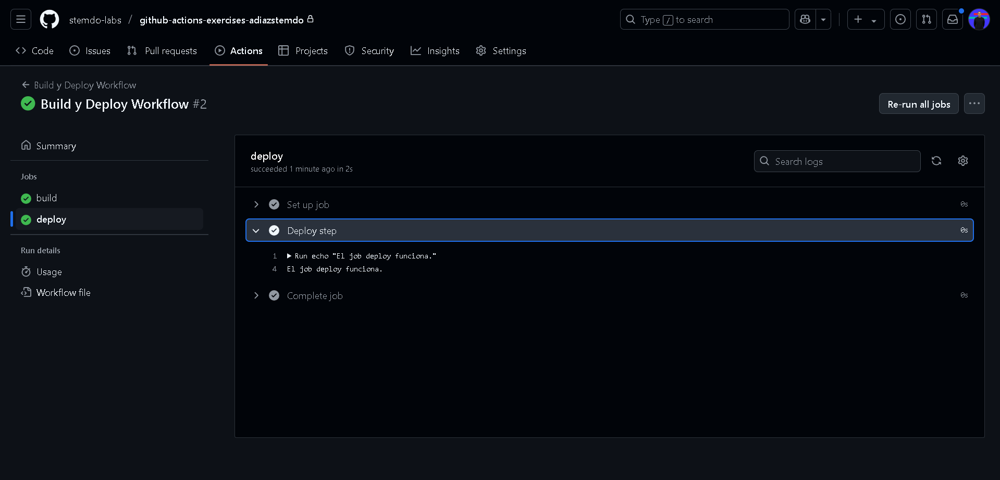

# Jobs y Steps - Ejercicio 2

## 1. Configura dos jobs en un único workflow: "build" y "deploy"
- En el job deploy imprime un mensaje por la consola.
- El job deploy debe depender del éxito del job build.
- Si el job "build" falla, el job "deploy" **no debe ejecutarse.**


He creado el yml con los dos jobs (build y deploy) lo cual es muy fácil y he simulado un error para que se ejecutara el deploy.

```
name: Build y Deploy Workflow

on:
  workflow_dispatch:

jobs:
  build:
    runs-on: labs-runner
    steps:
      - name: Comprobar código
        uses: actions/checkout@v3

      - name: Build step (simulado)
        run: |
          echo "Ejecutando proceso de build..."
          exit 1

  deploy:
    runs-on: ubuntu-latest
    needs: build
    steps:
      - name: Deploy step
        run: echo "El job deploy funciona."
```

Como he simulado un error me sale que hay un fallo y no se ejecuta correctamente:


Ahora vamos a arreglar el error y vamos a ver que ocurre:


Se ve claramente que tanto el build como el deply han funcionado