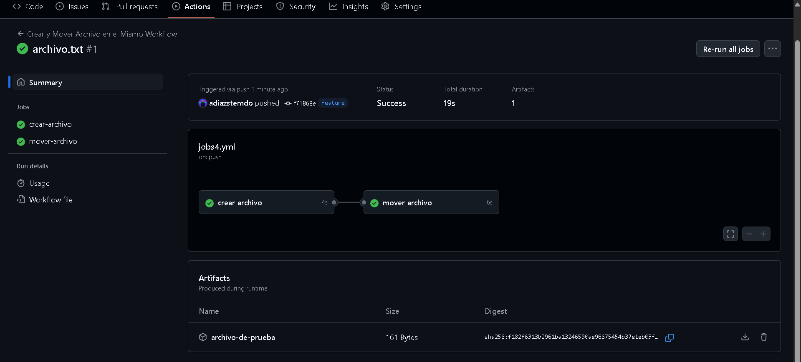

# Jobs - Ejercicio 4

## 1. Crea un job el cual cree un archivo .txt llamado "test"

## 2. Crea otro job que mueva el archivo creado anteriormente a otro directorio. ¿Qué es lo que ocurre?

### ¿Qué ocurre?


Para este ejercicio he creado dos jobs, uno para crear el archivo y el otro para mover el archivo

```
name: Crear y Mover Archivo en el Mismo Workflow

on:
  push:
    branches:
      - feature

jobs:
  crear-archivo:
    runs-on: labs-runner
    steps:
      - name: Crear archivo test.txt
        run: echo "Este es un archivo de prueba" > test.txt   # Aquí estoy rediriegiendo la salida de echo a un archivo llamado test.txt

      - name: Subir archivo como artefacto
        uses: actions/upload-artifact@v4
        with:
          name: archivo-de-prueba
          path: test.txt

  mover-archivo:
    runs-on: labs-runner
    needs: crear-archivo
    steps:
      - name: Descargar el archivo
        uses: actions/download-artifact@v4
        with:
          name: archivo-de-prueba

      - name: Mover el archivo a otro directorio
        run: |
          mkdir destino                          # Creo la carpeta     
          mv test.txt destino/                   # Muevo el archivo a la carpeta    
          echo "Contenido de 'destino/'"
          ls destino/                            # Listo el contenido de la carpeta para ver que se ha movido correctamente
```

