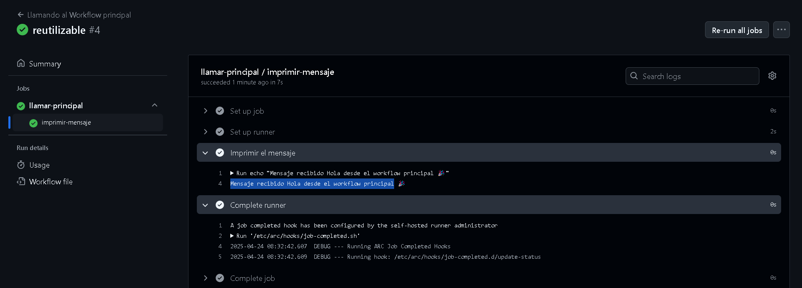

# Workflows reusables - Ejercicio 1

## Configura un workflow reutilizable que simplemente imprima un mensaje

## Luego, crea otro workflow que use ese workflow reutilizable

Para hacer este ejercicio hay que crear 2 workflows, uno que es el principal y el otro el reutilizable que llamará al principal.
Este es el código de mi workflow principal. con el parámetro ***workflow_call*** hacemos que se ejecute si le llama otro workflow que se ejecute
Este es el código de mi workflow principal:
```
name: Workflow Principal

on:
  workflow_call:    # Este workflow solo se ejecutará cuando haya otro workflow que lo llame
    inputs:
      mensaje:
        required: true
        type: string

jobs:
  imprimir-mensaje:
    runs-on: labs-runner
    steps:
      - name: Imprimir el mensaje
        run: echo "Mensaje recibido ${{ inputs.mensaje }}"
```

Y este es el workflow reutilizable:

```
name: Llamando al Workflow principal

on:
  push:
    branches:
      - '**' # Se ejecuta en cualquier rama

jobs:
  llamar-principal:
    uses: ./.github/workflows/principal.yml
    with:
      mensaje: "Hola desde el workflow principal"

```

Pongo la ruta de mi workflow principal para que le llame
Pusheo el workflow y se ejecuta correctamente

