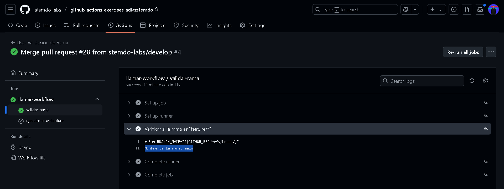

# Workflows reusables - Ejercicio 2

## Configura un workflow reutilizable que primero valide si el nombre de la rama con la que se ejecuta empieza con "feature/". Solo si la validación es exitosa, se ejecutará la tarea principal

He creado dos workflows, uno con dos jobs que es el que va a comprobar la rama y la ejecución de esta y el otro workflow que lo va a llamar al reutilizable

Este es el código de mi reutilizable:
```
name: Validar y Ejecutar si es feature/

on:
  workflow_call:    # Llamamos al workflow para que solo se ejecute si le llama otro workflow
    inputs:
      mensaje:
        required: true
        type: string

jobs:
  validar-rama:
    runs-on: labs-runner
    outputs:
      es_feature: ${{ steps.verificar.outputs.es_feature }}   # Creo el output es_feature que después tendrá el valor true o false
    steps:
      - name: Verificar si la rama es "feature/*"
        id: verificar
        run: |
          BRANCH_NAME="${GITHUB_REF#refs/heads/}"          # Creo la variable BRANCH_NAME en el que se encuentra la rama delrepositorio
          echo "Nombre de la rama: $BRANCH_NAME"
          
          if [[ "$BRANCH_NAME" == feature/* ]]; then       # Creo un IF que valide la rama
            echo "es_feature=true" >> $GITHUB_OUTPUT
          else
            echo "es_feature=false" >> $GITHUB_OUTPUT
          fi

  ejecutar-si-es-feature:
    needs: validar-rama
    if: needs.validar-rama.outputs.es_feature == 'true'    # Si la rama es feature el valor será true, con lo cual se ejecutará
    runs-on: labs-runner
    steps:
      - name: Ejecutando tarea principal
        run: echo "Esta rama es una feature. Ejecutando acción principal..."

```

Aquí hice el otro workflow para validar el reutilizable:

```
name: Usar Validación de Rama

on:
  push:
    branches:
      - '**'

jobs:
  llamar-workflow:
    uses: ./.github/workflows/reutilizable2.yml   # Ruta de mi workflow con los dos jobs anteriormente descritos
    with:
      mensaje: "Alejandro Díaz en Stemdo"

```

Evidentemente como no es la rama feature no se ha ejecutado el workflow


