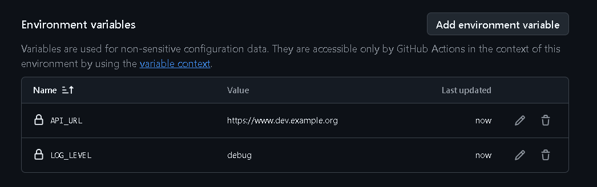

# Workflows reusables - Ejercicio 3

## En este ejercicio, configurarás un workflow reutilizable (deploy-environment.yml) que realizará tareas de despliegue basadas en un entorno específico.

## Este workflow reutilizable será llamado por otro workflow (trigger-deploy.yml) que se ejecutará automáticamente en función de la rama en la que se realice el push o mediante ejecución manual.

Cada entorno (development, staging, production) tendrá configuradas sus propias variables de entorno y secretos en GitHub, los cuales serán utilizados automáticamente por el workflow correspondiente.

Para este ejercicio se utilizarán dos repositorios, uno público, y el repositorio privado en el que se ha estado trabajando.

## Paso a paso:

> 1. Configuración de Environments en GitHub:
>
> - En el repositorio público, ve a Settings > Environments.
> - Crea tres environments: development, staging, y production.
> - Configura variables de entorno específicas para cada environment, como:
>   - API_URL
>   - LOG_LEVEL
> Estas variables de entorno tendrán valores diferentes dependiendo del environment seleccionado.

[Administración de entornos en GitHub](https://docs.github.com/es/actions/managing-workflow-runs-and-deployments/managing-deployments/managing-environments-for-deployment)

> 2. Definir el Workflow Reutilizable:
>
> Crea un archivo llamado deploy-environment.yml en el directorio .github/workflows/.
> Este workflow reutilizable recibirá un input llamado environment, el cual determinará el environment de despliegue.

> 3. Definir el Workflow que Invoca al Reusable:
>
> Crea un archivo llamado trigger-deploy.yml en el directorio .github/workflows/.
> Este workflow se activará en función de las ramas (main, develop, release/*) y llamará al workflow reutilizable para desplegar en el entorno correspondiente.

---

Para poder entrar a los Entornos primero el repositorio debe de ser público, después se habilitará la pestaña de *Environments*:


Creo los entornos:


Creo las variables dentro de cada entorno:



Para esta práctica he creado dos workflows en el que uno llamará al otro **(reusable3.yml -> main.reusable3.yml)**

***main.reusable3.yml***

```
name: Desplegar entorno

on:
  workflow_call:
    inputs:
      environment:
        description: 'Entornos a desplegar (development, staging, production)'
        required: true
        type: string

jobs:
  deploy:
    runs-on: ubuntu-latest
    environment: ${{ inputs.environment }}
    
    steps:
      - name: Checkout code
        uses: actions/checkout@v3

      - name: variables de entorno
        run: |
          echo "API_URL=${{ secrets[inputs.environment + '_API_URL'] }}" >> $GITHUB_ENV
          echo "LOG_LEVEL=${{ secrets[inputs.environment + '_LOG_LEVEL'] }}" >> $GITHUB_ENV

      - name: Desplegar en ${{ inputs.environment }}
        run: |
          echo "Desplegando en ${INPUT_ENVIRONMENT}..."
          echo "Using API_URL=$API_URL y LOG_LEVEL=$LOG_LEVEL"

      - name: Verificar despliegue
        run: |
          echo "Verificando despliegue..."
          echo "Despliegue en ${INPUT_ENVIRONMENT} verificado con éxito."
```
---

***reusable3.yml***

```
name: Despliegue de Trigger 

on:
  push:
    branches:
      - '**'
  workflow_dispatch:

jobs:
  trigger-deploy:
    runs-on: ubuntu-latest
    steps:
      - name: Checkout code
        uses: actions/checkout@v3

      - name: Determine deployment environment
        id: environment
        run: |
          if [[ "${GITHUB_REF}" == "refs/heads/main" ]]; then
            echo "Desplegando a production"
            echo "environment=production" >> $GITHUB_ENV
          elif [[ "${GITHUB_REF}" == "refs/heads/develop" ]]; then
            echo "Desplegando a development"
            echo "environment=development" >> $GITHUB_ENV
          elif [[ "${GITHUB_REF}" == refs/heads/release/* ]]; then
            echo "Desplegando a staging"
            echo "environment=staging" >> $GITHUB_ENV
          fi

      - name: Llamando a workflow
        uses: ./.github/workflows/main.reusable3.yml
        with:
          environment: ${{ env.environment }}
```

