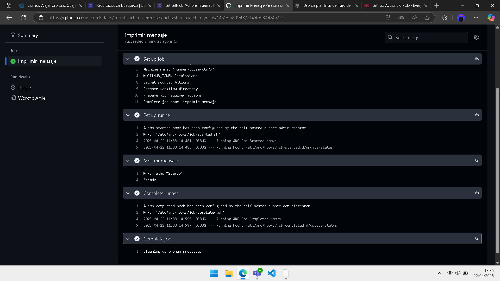

# Triggers (Dispatch) - Ejercicio 

## 1. Configura un workflow para que se ejecute manualmente usando el evento workflow_dispatch.

## 2. Define un input llamado _"message"_ que permita al usuario ingresar un mensaje personalizado.

## 3. El workflow debe ser capaz de imprimir ese mensaje.

He creado el workflow dispatch1.yml con la siguiente configuración:

```
name: Imprimir Mensaje Personalizado

on:
  workflow_dispatch:
    inputs:
      message:
        description: 'Mensaje personalizado para imprimir'
        required: true
        default: 'Stemdo'

jobs:
  imprimir-mensaje:
    runs-on: labs-runner

    steps:
      - name: Mostrar mensaje
        run: echo "${{ github.event.inputs.message }}"
```

Desde la rama *Develop* he creado el pull, al igual que en los ejercicios anteriores y este es el resultado:

