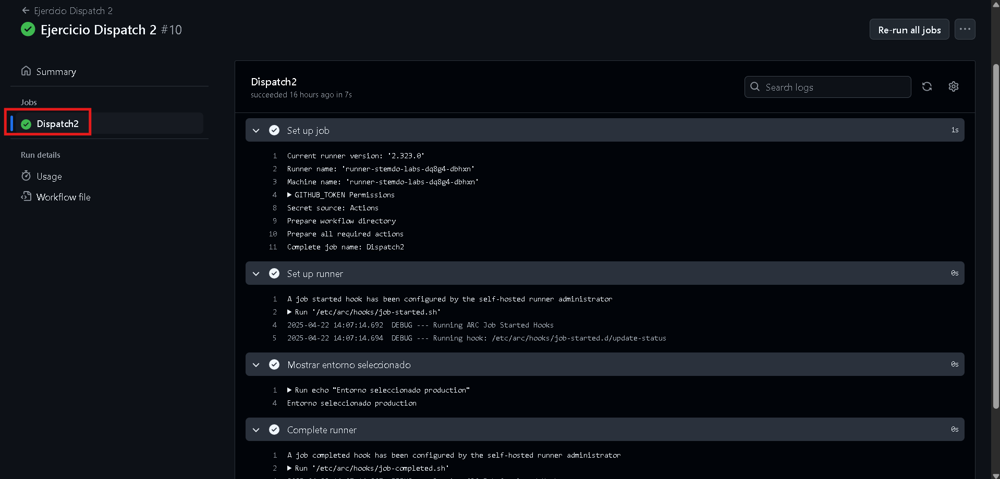

# Triggers (Dispatch) - Ejercicio 2

## 1. Configura un workflow para que se ejecute manualmente usando el evento workflow_dispatch.

## 2. Define un input llamado "_environment_" que permita seleccionar entre "_production_" y "_staging_".

## 3. Imprime el entorno seleccionado en la consola.

He creado el archivo en la carpeta workflow/ llamado dispatch2.yml

```
name: Ejercicio Dispatch 2

on:
  workflow_dispatch:  # Nos permite ejecutar el workflow manualmente desde Github
    inputs:
      environment:
        description: 'Selecciona el entorno'
        required: true
        default: staging   
        type: choice
        options:
          - production
          - staging

jobs:
  Dispatch2:
    runs-on: labs-runner
    steps:
      - name: Mostrar entorno seleccionado
        run: echo "Entorno seleccionado ${{ github.event.inputs.environment }}" 
```

y al igual que en ejercicios anteriores hariamos un git add ., un commit y luego un git push.
Entro en GitHub y este sería el resultado:

