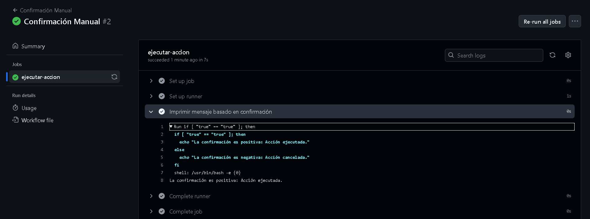

# Triggers (Dispatch) - Ejercicio 2

## 1. Configura un workflow para que se ejecute manualmente usando el evento workflow_dispatch.

## 2. Define un input llamado _"confirm"_ que requiera una _confirmación_ ("true" o "false").

## 3. Imprime un mensaje, dependiendo de si la confirmación es positiva o negativa.

Con ***workflow_dispatch*** nuestro workflow se ejecutará cuando nosotros lo corramos 

```
name: Confirmación Manual

on:
  workflow_dispatch:
    inputs:
      confirm:
        description: 'Confirmar true o false'
        required: true
        type: choice
        options:
          - 'true'
          - 'false'

jobs:
  ejecutar-accion:
    runs-on: labs-runner
    steps:
      - name: Imprimir mensaje basado en confirmación
        run: |
          if [ "${{ github.event.inputs.confirm }}" == "true" ]; then
            echo "La confirmación es positiva: Acción ejecutada."
          else
            echo "La confirmación es negativa: Acción cancelada."
          fi

```

He hecho un if como condición para que nos de la respuesta según sea True o False
Lo ejecuto manualmente y este es el resultado
