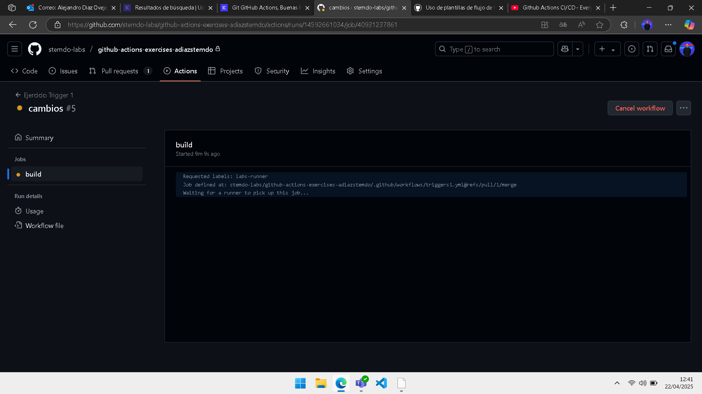

# Triggers - Ejercicio 1

## Configura un workflow para que se ejecute cuando se abre un Pull Request

En la carpeta .github/workflows he creado el archivo *triggers1.yml* con la siguiente configuración:

```
name: Ejercicio Trigger 1

on:
  pull_request:
    branches:
      - main

jobs:
  build:
    runs-on: labs-runner
    
    steps:
     - name: Mostrar mensaje
       run: echo "Workflow creado"
```

El workflow va a tener el nombre "Ejercicio Trigger 1" para la rama *main* en un contenedor *labs-runner* que nos ha dado Stemdo.
Creamos un nuevo pull-request:


Aquí estaría ejecutándose, como estabamos todos con ello pues tardaba mucho
