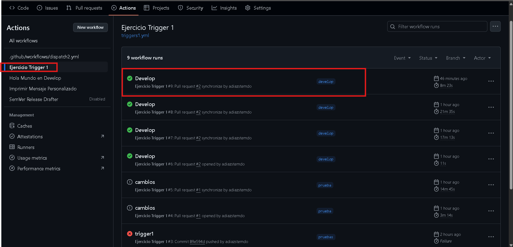
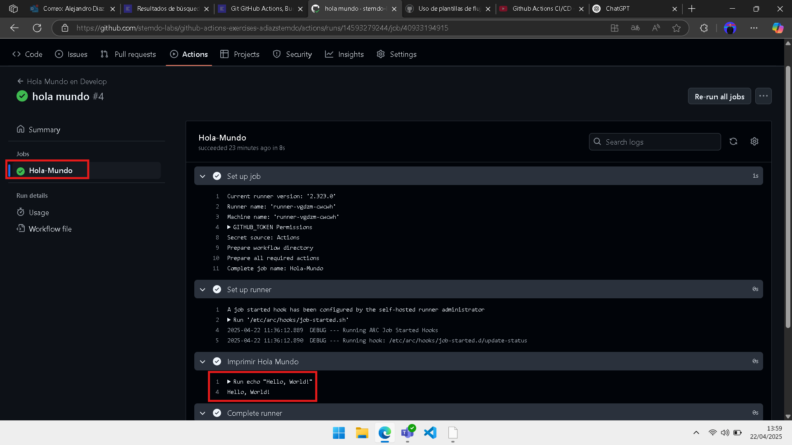

# Triggers - Ejercicio 2

## Configura un workflow para que se ejecute cuando se haga un push en la rama develop y simplemente imprima "Hello, World!" en la consola

Similar al primer ejercicio pero he cambiado el archivo yml con la siguiente configuración:

```
name: Hola Mundo en Develop

on:
  push:
    branches:
      - develop

jobs:
  Hola-Mundo:
    runs-on: labs-runner

    steps:
      - name: Imprimir Hola Mundo
        run: echo "Hello, World!"
"
```
Ejecuto un git add . , git commit y un git push para que se suba el workflow al repositorio y poder ejecutarlo
Se ha ejecutado correctamente:


