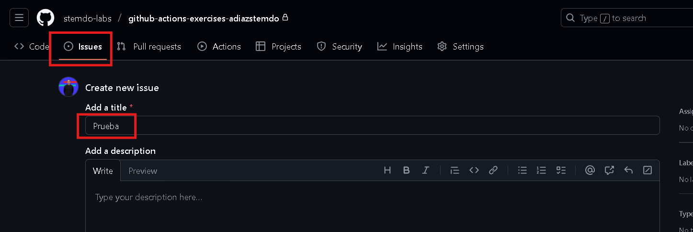
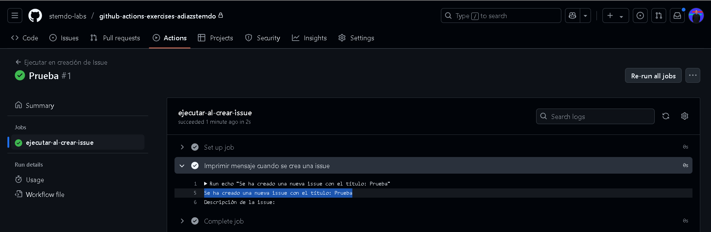

# Triggers - Ejercicio 3

## Configura un workflow para que se ejecute cuando se cree una nueva Issue

Para los issues necesitamos el evento ***on: issues***. con ***types: [opened]*** especificamos que el workflow se ejecutará cuando se abra un issue

```
name: Ejecutar en creación de Issue

on:
  issues:
    types: [opened]  # Esto ejecuta el workflow cuando se abre una nueva Issue

jobs:
  ejecutar-al-crear-issue:
    runs-on: labs-runner
    steps:
      - name: Imprimir mensaje cuando se crea una issue
        run: |
          echo "Se ha creado una nueva issue con el título: ${{ github.event.issue.title }}"     # Variable predefinida de issues
          echo "Descripción de la issue: ${{ github.event.issue.body }}"                        # Variable predefinida de issues

```
He creado el Issue entrando en la pestaña *Issues* y lo he llamado *Prueba*


Y efectivamente se ejecuta al haber un issue creado y coge el nombre del Issue
