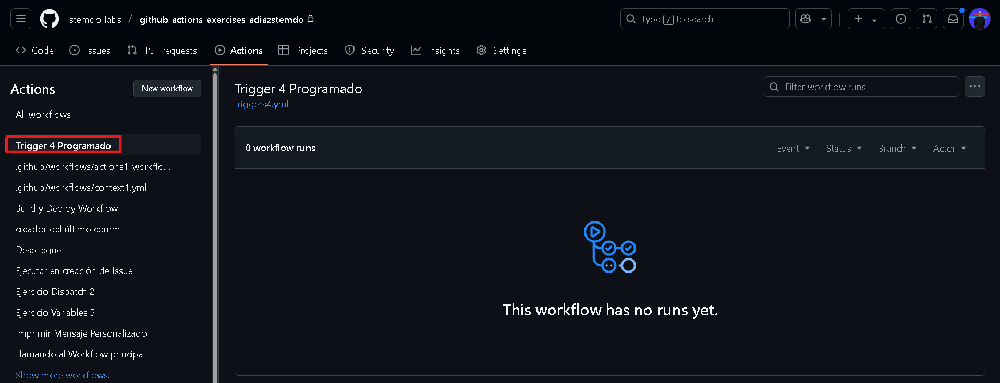

# Triggers - Ejercicio 4

## Configura un workflow para que se ejecute todos los días a las 12:00 UTC y que imprima "Scheduled job executed!" en la consola

Con el evento ***schedule*** programamos la ejecución del workflow. Con *cron* especificamos el momento, yo en micaso le he pedido que se ejecute de Lunes a Viernes a las 8 de la mañana

```
name: Trigger 4 Programado

on:
  schedule:
    - cron: '0 8 * * 1-5'  # Se ejecuta de Lunes a Viernes a las 8:00 que es cuando entro a Stemdo

jobs:
  programado:
    runs-on: labs-runner
    steps:
      - name: Imprimir mensaje
        run: echo "Scheduled job executed!"

```
Ejecuto el workflow y evidentemente no se ejecuta por que no es la hora marcada
