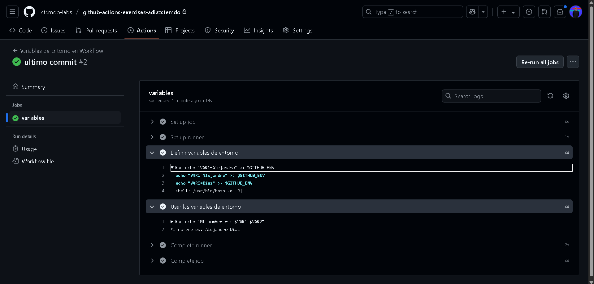

# Variables y Outputs - Ejercicio 1

## Configura un workflow con un solo job que haga las siguientes tareas

- En el primer step, define dos variables de entorno.
- En el segundo step, usa estas variables para ejecutar un comando o script.

Este ejercicio es bastante sencillito ya que la creación de variables es igual que en bash

```
name: Variables de Entorno en Workflow

on:
  push:
    branches:
      - '**'

jobs:
  variables:
    runs-on: labs-runner

    steps:
      - name: Definir variables de entorno
        run: |
          echo "VAR1=Alejandro" >> $GITHUB_ENV
          echo "VAR2=Díaz" >> $GITHUB_ENV

      - name: Usar las variables de entorno
        run: |
          echo "Mi nombre es: $VAR1 $VAR2"
```

> VAR1=Alejandro >> $GITHUB_ENV
Redirigimos la salida a una variable de entorno de Github.
Pusheamos el workflow y lo ejecutamos.

