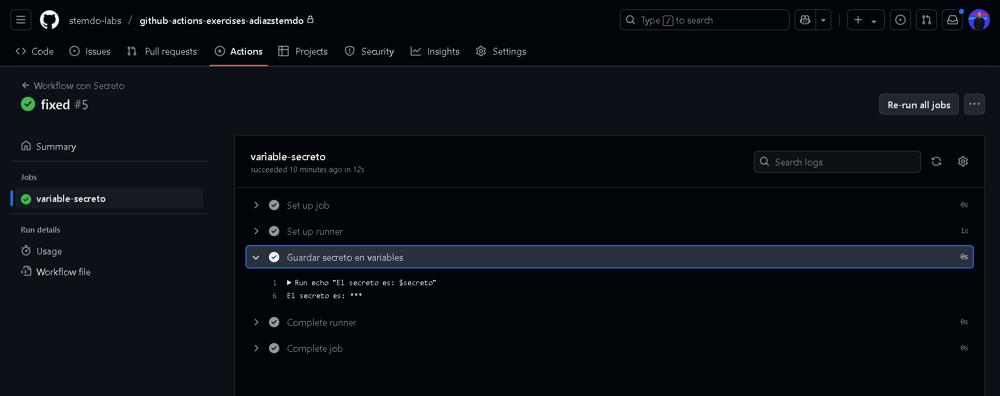

# Variables y Outputs - Ejercicio 2

## Configura un job que use un secreto definido en el repositorio (por ejemplo, MY_SECRET) y lo use en un comando.

Antes de empezar debemos de crear nuestro secreto. Entramos en los ***settings*** del repositorio -> *secrets and variables* -> *Actions* y en la pestaña *Secrets* creamos el secreto que github se lo tomará como una variable de entorno
Yo en mi caso lo he llamado **MISECRETO** y he escrito un texto. 


Después he creado mi archivo *variables2.yml* que extraerá el secreto
Con el parámetro **env** podemos extraer el secreto como una variable de entorno.

```
name: Workflow con Secreto

on:
  push:
    branches:
      - '**'

jobs:
  variable-secreto:
    runs-on: labs-runner

    steps:
      - name: Guardar secreto en variables
        env:
          secreto: ${{ secrets.MISECRETO }}
        run: |
          echo "El secreto es: $secreto"

```

Y este sería el resultado:
El secreto aparece con asteriscos, lo cual significa que ha funcionado ya que aparece encriptado

