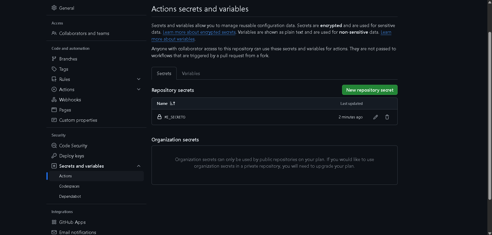
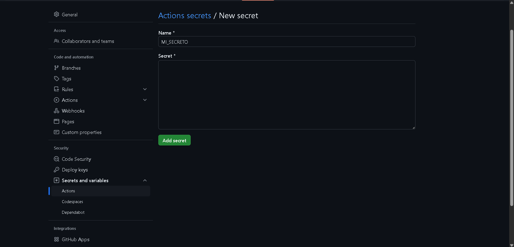

# Variables y Outputs - Ejercicio 2

## Configura un job que use un secreto definido en el repositorio (por ejemplo, MY_SECRET) y lo use en un comando.

```
name: Workflow con Secreto

on:
  push:
    branches:
      - '**'

jobs:
  example-job:
    runs-on: labs-runner

    steps:
      - name: Usar secreto en un comando
        run: |
          echo "Usando el secreto en un comando."
          echo "El valor del secreto es: $MI_SECRETO"
```


