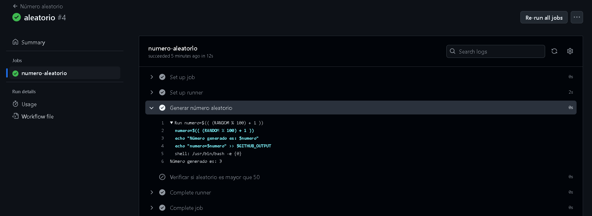

# Variables y Outputs - Ejercicio 3

## Configura un workflow siguiendo estos pasos:

- Define un step que genere un número aleatorio del 1 al 100.

- En el segundo step, utiliza un condicional para ejecutar comandos solo si el número es mayor a 50.

Creo la variable aleatorio que recogerá el número aleatorio con ***numero=$(( (RANDOM % 100) + 1 ))***
Después, para que esa variable se pueda utilizar en otro step la almaceno con > $GITHUB_OUTPUT
En el siguiente step llamo a esa función con la condición if y le digo que si es mayor de 50 me muestre un mensaje


```
name: Número aleatorio

on:
  push:
    branches:
      - '**'

jobs:
  numero-aleatorio:
    runs-on: labs-runner

    steps:
      - name: Generar número aleatorio
        id: aleatorio
        run: |
          numero=$(( (RANDOM % 100) + 1 ))
          echo "Número generado es: $numero"
          echo "numero=$numero" >> $GITHUB_OUTPUT
      
      - name: Verificar si aleatorio es mayor que 50
        if: ${{ steps.random.outputs.numero > 50 }}
        run: |
          echo "El número ${{ steps.random.outputs.numero }} es mayor a 50"
```

Me genera bien el número aleatorio pero como no es mayor de 50 el step de verificación no se ejecuta
