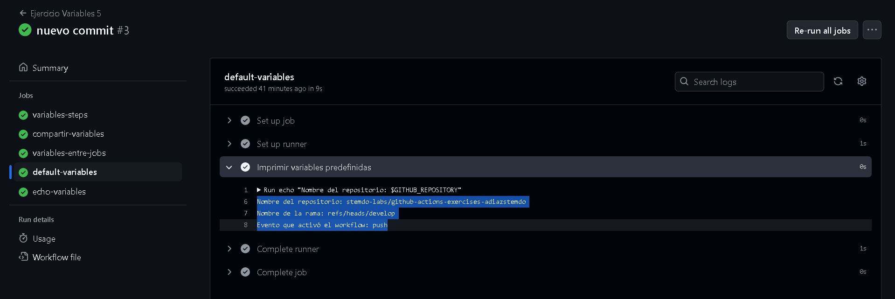

# Ejercicio 5

Voy a ir desglosando lo que se va a ir pidiendo para que se entienda mejor:

Variables entre pasos de un mismo job:

- Crea un job que:
  - Defina una variable local ``var1`` con valor 1 y la imprima.
  - Defina una variable ``var2`` usando el entorno de GitHub (``$GITHUB_ENV``) con valor 2.
  - Imprima el valor de ``var2`` en un paso diferente.

```
jobs:
  variables-steps:
    runs-on: labs-runner
    steps:
      - name: Definir y imprimir var1
        run: |
          var1=1                  # Creo la variables
          echo "var1=$var1"       # Imprimo la variable

      - name: Definir var2 usando $GITHUB_ENV
        run: |
          echo "var2=2" >> $GITHUB_ENV       # Defino la variable 2 en una variable de entorno de GitHub

      - name: Imprimir var2 en otro step
        run: |
          echo "El valor de var2 es: $var2"     # Imprimo la variable 2 en otro step
```

Para este ejercicio lo he hecho de la manera más sencilla y no he utilizado el parámetro ***env*** para crear las variables, sino que cada job tendrá sus variables.


---
Compartir variables entre pasos usando outputs:

- Crea un job que:
  - Defina un output ``var_step_output`` con valor "valor".
  - Imprima el valor de ``var_step_output`` en un paso posterior.

```
compartir-variables:
    runs-on: labs-runner
    steps:
      - name: Definir output var_step_output
        id: step1
        run: |
          echo "::set-output name=var_step_output::valor"

      - name: Imprimir output var_step_output
        run: |
          echo "El valor de var_step_output es: ${{ steps.step1.outputs.var_step_output }}"
```

Cada step es un proceso separado, con lo cual las variables no sobreviven, para eso utilizamos los ***outputs***
He creado la variable var_step_output y la he llamado con ***${{ steps.step1.outputs.var_step_output }}***


---
Compartir variables entre jobs:

- Crea un job que:
  - Imprima el valor de ``var2`` y observa qué sucede.
  - Defina un output ``var3`` con valor 3 para compartir con otros jobs.

```
variables-entre-jobs:
    runs-on: labs-runner
    outputs:
      var3: ${{ steps.definir.outputs.var3 }}
    steps:
      - name: Imprimir el valor de var2 (no está definida, por lo que fallará)
        run: |
          echo "El valor de var2 es: $var2"

      - name: Definir output var3
        id: definir
        run: echo "var3=3" >> $GITHUB_OUTPUT
```

Este job tiene como objetivo compartir una variable (var3) con otros jobs, usando el sistema de outputs entre jobs
En el siguiente job veremos como llamo a esta variable, pero básicamente he utilizado de nuevo el *output* con ***$GITHUB_OUTPUT***


---
Imprimir variables entre jobs:

- Crea un job que dependa del anterior y:
  - Imprima el valor de ``var3`` definido en el job anterior.

```
echo-variables:
    needs: variables-entre-jobs
    runs-on: labs-runner
    steps:
      - name: Imprimir el valor de var3 desde job anterior
        run: |
          echo "El valor de var3 desde job anterior es: ${{ needs.variables-entre-jobs.outputs.var3 }}"
```
Para este job necesita del anterior job (variables-entre-jobs) para poder llamar a la variable 3 creada anteriormente y por eso utilizamos ***needs: variables-entre-jobs***. Igualmente utilizamos el output para mostrar la variable. Se ve claramente que tiene el valor *3*


---
Usar variables predefinidas de GitHub:

- Crea un job que imprima las siguientes variables predefinidas por GitHub:
  - Nombre del ``repositorio``.
  - Nombre de la ``rama``.
  - Nombre del ``evento`` que activó el workflow.

```
default-variables:
    runs-on: labs-runner
    steps:
      - name: Imprimir variables predefinidas
        run: |
          echo "Nombre del repositorio: $GITHUB_REPOSITORY"
          echo "Nombre de la rama: $GITHUB_REF"
          echo "Evento que activó el workflow: $GITHUB_EVENT_NAME"
```

Ya habiamos trabajado con variables que mostraban la arquitectura y el SO del sistema pero no habíamos utilziado variables que ya venían predefinidas en GITHUB.
Esas variables son: ***$GITHUB_REPOSITORY*** ***$GITHUB_REF*** y ***$GITHUB_EVENT_NAME***



---

Este sería el resultado del workflow. la verdad que trabajar con variables en workflow ha sido para mí de lo más entretenido e interesante de este módulo, a parte de las múltiples funcionalidades que tiene esto.
Este sería el resultado de todo el workflow
